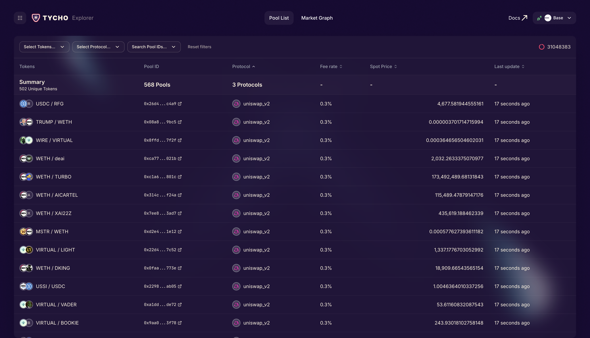

# Tycho Explorer

A real-time DeFi pool explorer. 



Pool Explorer is a local user interface designed to explore Decentralized Exchange (DEX) pools. It provides low-latency access to comprehensive and trustlessly reliable data, making on-chain liquidity easy to observe and explore. With Pool Explorer, you can filter for specific pools and visually explore the entire set of DEX pools, enabling better decision-making for Solvers, Searchers and DEX Operators.

# Features

- **Multi-Chain Support**: Switch between Ethereum, Base, and Unichain
- **Real-time Updates**: WebSocket connection for live pool data
- **Mobile Friendly**: Fully responsive design for mobile browsers
- **Pool Filtering**: Filter by tokens, protocols, and pool IDs
- **Graph Visualization**: Interactive network graph of liquidity pools
- **Swap Simulation**: Simulate trades on selected pools

## Quick Start

```bash
# Clone the repository
git clone <repository-url>
cd tycho-explorer

# Set up environment files
cp .env.example .env        # Production config
cp .env.example .env.dev    # Development config
# Edit both files with your API keys

# Start production environment (background)
make up

# Start development environment (hot reload)
make up DEV=1

# Or start specific service without dependencies
make up DEV=1 SERVICE=frontend-dev
```

## Project Structure

```
tycho-explorer/
├── api/                # Rust backend API
├── frontend/          # React frontend application  
├── docs/              # Project documentation
├── docker-compose.yml # Production configuration
├── docker-compose.dev.yml # Development configuration
├── Makefile          # Convenience commands
└── .env              # Environment configuration
```

## Services

- **API (Rust)**: Real-time pool data streaming from Tycho protocol
  - Ethereum: http://localhost:3001 (prod) / 4001 (dev)
  - Base: http://localhost:3002 (prod) / 4002 (dev)
  - Unichain: http://localhost:3003 (prod) / 4003 (dev)
  - **Note**: In production, all API services use the same Docker image (`tycho-explorer/api:latest`)

- **Frontend (React)**: Interactive pool explorer and swap simulator
  - Production: http://localhost:8080
  - Development: http://localhost:5173 (use 127.0.0.1 instead of localhost on macOS if `localhost` doesn't work)

## Development

### Starting Services

```bash
# Production mode (runs in background)
make up                  # Start all services
make up SERVICE=frontend # Start specific service

# Development mode (hot reload, logs in terminal)
make up DEV=1            # Start all services
make up DEV=1 SERVICE=frontend-dev # Start specific service

# Force rebuild before starting
make up BUILD=1          # Production
make up DEV=1 BUILD=1    # Development

# See Makefile for details.
```

## Documentation

See the `docs/` directory for detailed documentation:
- `docs/memory-bank/` - Project context and specifications
- `docs/development.md` - Development setup guide

## Requirements

- Docker & Docker Compose
- Tycho API key
- RPC URLs for supported chains
- API endpoint configuration for REST calls
