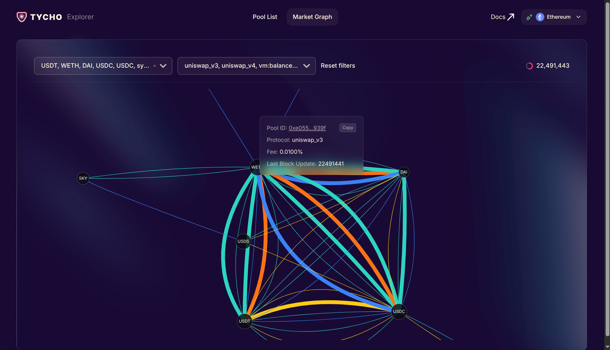

# Pool Explorer



Pool Explorer is a local user interface designed to explore Decentralized Exchange (DEX) pools. It provides low-latency access to comprehensive and trustlessly reliable data, making on-chain liquidity easy to observe and explore. With Pool Explorer, you can filter for specific pools and visually explore the entire set of DEX pools, enabling better decision-making for traders, DEXs, and protocols.

# Quick Start

To get started with Pool Explorer, follow these steps:

1.  **Clone the repository:**
    ```bash
    git clone https://github.com/ex9-fyi/swift-price-oracle.git
    ```
2.  **Navigate into the project directory:**
    ```bash
    cd swift-price-oracle
    ```
3.  **Make the startup script executable:**
    ```bash
    chmod +x start-prod.sh
    ```
4.  **Run the application:**
    ```bash
    ./start-prod.sh --parallel
    ```
This will start the application.
