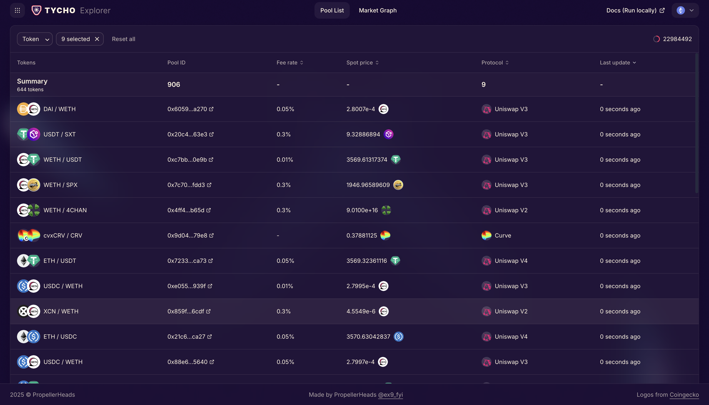
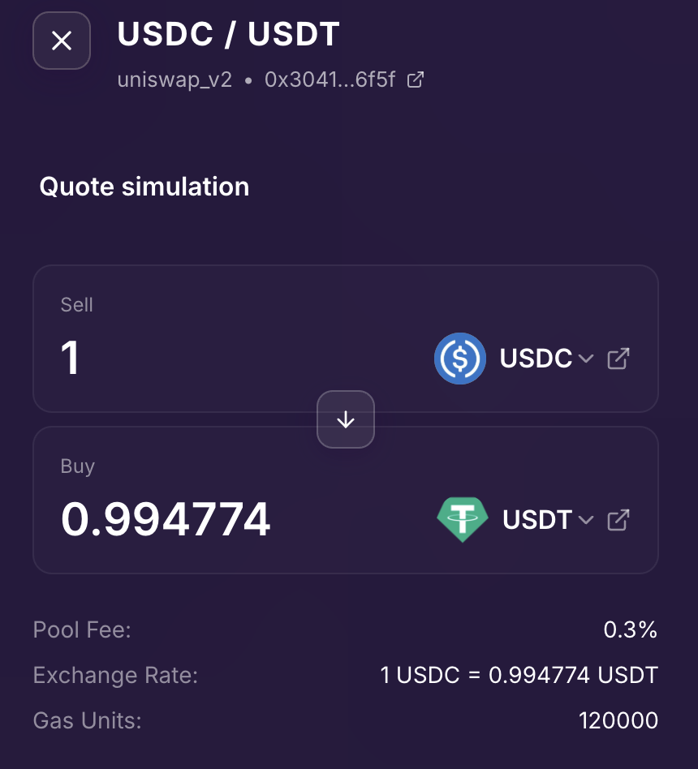
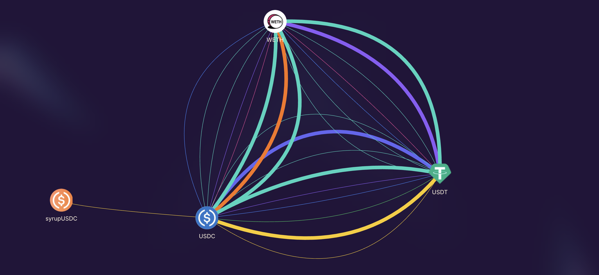

Tycho Explorer is a data dashboard for all decentralized exchanges. Like etherscan but for decentralized exchanges. 

For example, you can list all the decentralized exchanges that operate on Ethereum from some of the most popular protocols - Uniswap, Curve, Balancer.



You can interact with these exchanges / pools. For example, you can get a qoute - how much coin B will you get for this much coin A?



Suppose you want to understand what the cheapest way is to sell a large amount of coin A for coin B, you can begin your inquiry by graphing out the best list of trades to make starting with coin A to get coin B. This is analogous to finding the least congested road going from work to home.



## Quick Start

```bash
# Clone the repository
git clone <repository-url>
cd tycho-explorer

# Set up environment files
cp .env.example .env        # Production config
cp .env.example .env.dev    # Development config
# Edit both files with your API keys

# Start production environment (background)
make up

# Start development environment (hot reload)
make up DEV=1

# Or start specific service without dependencies
make up DEV=1 SERVICE=frontend-dev
```

## Project Structure

```
tycho-explorer/
├── api/                # Rust backend API
├── frontend/          # React frontend application  
├── docs/              # Project documentation
├── docker-compose.yml # Production configuration
├── docker-compose.dev.yml # Development configuration
├── Makefile          # Convenience commands
└── .env              # Environment configuration
```

## Services

- **API (Rust)**: Real-time pool data streaming from Tycho protocol
  - Ethereum: http://localhost:3001 (prod) / 4001 (dev)
  - Base: http://localhost:3002 (prod) / 4002 (dev)
  - Unichain: http://localhost:3003 (prod) / 4003 (dev)
  - **Note**: In production, all API services use the same Docker image (`tycho-explorer/api:latest`)

- **Frontend (React)**: Interactive pool explorer and swap simulator
  - Production: http://localhost:8080
  - Development: http://localhost:5173 (use 127.0.0.1 instead of localhost on macOS if `localhost` doesn't work)

## Development

### Starting Services

```bash
# Production mode (runs in background)
make up                  # Start all services
make up SERVICE=frontend # Start specific service

# Development mode (hot reload, logs in terminal)
make up DEV=1            # Start all services
make up DEV=1 SERVICE=frontend-dev # Start specific service

# Force rebuild before starting
make up BUILD=1          # Production
make up DEV=1 BUILD=1    # Development

# See Makefile for details.
```

## Documentation

See the `docs/` directory for detailed documentation:
- `docs/memory-bank/` - Project context and specifications
- `docs/development.md` - Development setup guide

## Requirements

- Docker & Docker Compose
- Tycho API key
- RPC URLs for supported chains
- API endpoint configuration for REST calls